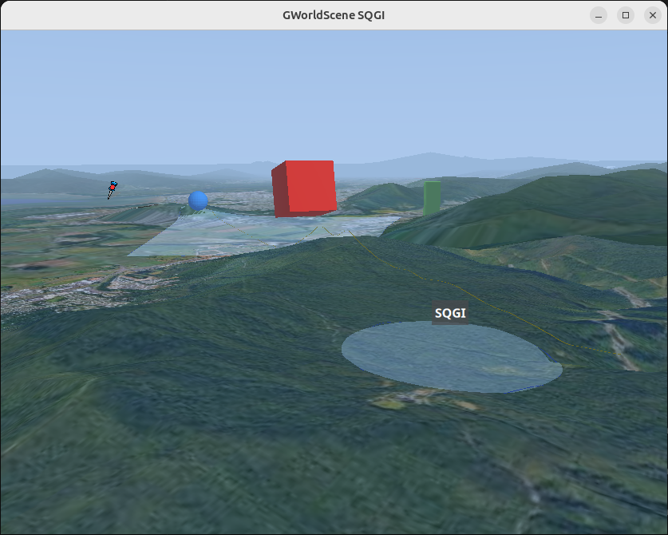
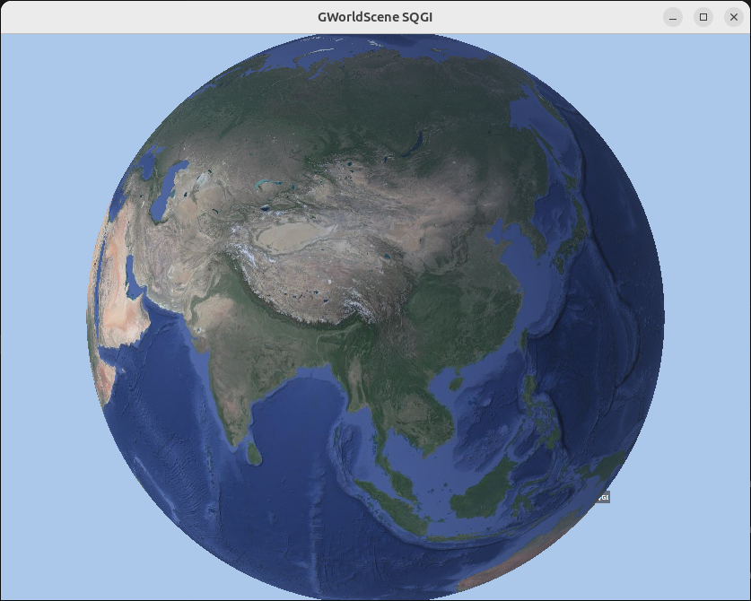
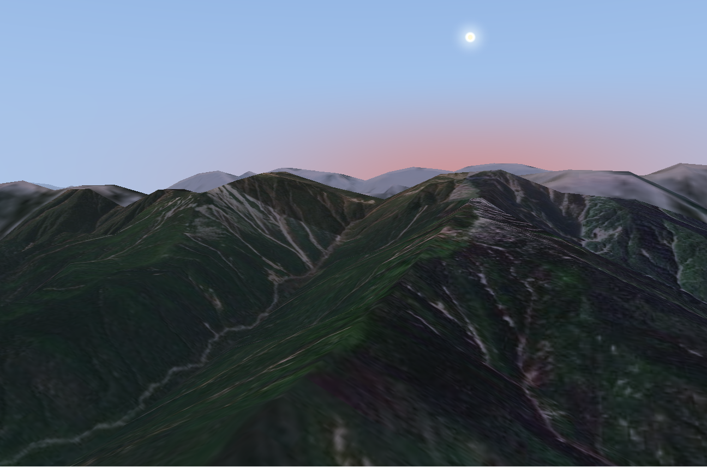

# GWorldScene

GWorldScene is a GTK 4 `GtkGLArea` widget for rendering geospatial scenes:
terrain, map imagery, a globe view, and scene graph objects positioned with
latitude, longitude, altitude, and local NED orientation.

It is currently an experimental geospatial rendering library with a C API,
GObject Introspection metadata, generated Vala bindings, and SQGI examples.



## Screenshots

| Scene nodes over terrain | Orbit/globe view | Sunlit mountainous terrain |
| --- | --- | --- |
|  |  |  |

## Features

- GTK 4 widget built on `GtkGLArea`.
- Local terrain rendering from HGT-style elevation tiles.
- Slippy-map texture imagery with disk caching.
- Earth-scale globe rendering when zoomed far out.
- Default Google-Earth-style camera plus free camera mode.
- Scene graph nodes positioned by geodetic coordinates.
- Local NED orientation for nodes: yaw, pitch, and roll.
- Primitive nodes: cube, sphere, and cylinder.
- Assimp-backed model loading, including common formats such as GLB/glTF and OBJ.
- Billboards, ground overlays, polylines, polygons, circles, and text labels.
- AMSL, AGL, and clamp-to-ground altitude modes where supported.
- Fog, sun position/time-of-day lighting, shadows, and terrain normal smoothing.
- Picking signals for terrain and renderable scene nodes.
- C, Vala, and SQGI examples.

## Dependencies

GWorldScene is built with Meson and Ninja. It depends on:

- GTK 4
- GObject Introspection
- gdk-pixbuf
- epoxy
- GDAL
- Assimp
- libsoup 3
- GLM
- zlib
- Vala, for the Vala example and generated VAPI

On Debian or Ubuntu-style systems:

```sh
sudo apt install meson ninja-build gcc g++ valac \
  libgtk-4-dev libgirepository1.0-dev libepoxy-dev libgdal-dev \
  libassimp-dev libsoup-3.0-dev libglm-dev zlib1g-dev \
  libgdk-pixbuf-2.0-dev
```

## Build

```sh
meson setup builddir
ninja -C builddir
meson test -C builddir --print-errorlogs
```

Install system-wide when you want the headers, pkg-config file, GIR, typelib,
and VAPI available to external programs:

```sh
sudo meson install -C builddir
```

The installed layout follows the platform GObject Introspection directories.
For example, on aarch64 Linux the typelib is installed under
`/usr/lib/aarch64-linux-gnu/girepository-1.0/`.

## Run The Demos

The main C demo starts near Cairns, Queensland, with terrain, satellite imagery,
fog, sun lighting, shadows, and a mix of scene nodes:

```sh
./builddir/examples/gworldscene-demo-gtk4
# or, when built with GTK3:
./builddir/examples/gworldscene-demo-gtk3
```

The Vala control panel exposes map provider, terrain, fog, sun, shadow, and
picking controls:

```sh
./builddir/examples/gworldscene-controls-gtk4
```

The SQGI scripts use the installed `GWorldSceneGtk3-0.1` or
`GWorldSceneGtk4-0.1` typelibs:

```sh
cd examples/sqgi
sqgi introspection-gtk3.nut
sqgi simple-scene-gtk3.nut
sqgi introspection-gtk4.nut
sqgi simple-scene-gtk4.nut
```

To run SQGI against an uninstalled build tree:

```sh
GI_TYPELIB_PATH=builddir/src \
LD_LIBRARY_PATH=builddir/src \
sqgi examples/sqgi/simple-scene-gtk4.nut
```

## Map Tiles And Terrain

The library default map tile template is OpenStreetMap:

```text
https://tile.openstreetmap.org/{z}/{x}/{y}.png
```

Applications can override map imagery with:

```c
gworld_scene_view_set_map_tile_url_template(view, "https://server/{z}/{x}/{y}.png");
```

The demo programs also honor:

```sh
export GWORLD_SCENE_MAP_TILE_URL_TEMPLATE='https://server/{z}/{x}/{y}.png'
```

For Google Map Tiles API experiments, the C demo can create a session when
`GWORLD_SCENE_GOOGLE_MAPS_API_KEY` is present. SQGI expects both the API key
and a session token:

```sh
export GWORLD_SCENE_GOOGLE_MAPS_API_KEY='...'
export GWORLD_SCENE_GOOGLE_MAPS_SESSION='...'
```

Terrain is loaded from HGT-style tile names such as `S16E145`. A terrain server
can be a base URL/directory or a template containing `{tile}` or `{name}`:

```c
gworld_scene_view_set_terrain_server(view, "https://example.com/terrain/data/");
gworld_scene_view_set_terrain_server(view, "https://example.com/{tile}.hgt.zip");
```

Disk caching is enabled by default and can be configured per view:

```c
gworld_scene_view_set_cache_directory(view, "/tmp/gworldscene-cache");
gworld_scene_view_set_cache_enabled(view, TRUE);
```

## Coordinates

Positions use geodetic coordinates:

- `latitude`: degrees north.
- `longitude`: degrees east.
- `altitude_amsl`: metres above mean sea level.

Scene node orientation uses the local NED frame:

- `yaw`: heading in degrees clockwise from geographic north.
- `pitch`: rotation around the local east/right axis.
- `roll`: rotation around the local north/forward axis.

Imported models are interpreted with NED-friendly axes: `+Z` is north/forward,
`+X` is east/right, and `+Y` is up. Model units are treated as metres before
node scale is applied.

## Scene Nodes

All renderable objects inherit from `GWorldSceneNode`. The view owns the nodes
returned from `add_*` methods; keep the returned pointer while you want to
modify the object, but do not unref it yourself.

Common node operations include:

- `set_position()`
- `translate_ned()`
- `slew_position()`
- `set_orientation_ned()`
- `rotate_ned()`
- `set_scale()`
- `set_color()`

Current renderable node types:

- `GWorldSceneCubeNode`
- `GWorldSceneSphereNode`
- `GWorldSceneCylinderNode`
- `GWorldSceneModelNode`
- `GWorldSceneBillboardNode`
- `GWorldSceneGroundOverlayNode`
- `GWorldScenePolylineNode`
- `GWorldScenePolygonNode`
- `GWorldSceneCircleNode`
- `GWorldSceneTextLabelNode`

## Minimal C Example

```c
#include <gtk/gtk.h>
#include <gworldscene/gworldscene.h>

static void
activate(GtkApplication *app)
{
  GtkWidget *window = gtk_application_window_new(app);
  GtkWidget *view = gworld_scene_view_new();

  gworld_scene_view_set_camera(GWORLD_SCENE_VIEW(view),
                               -16.8878,
                               145.7048,
                               7800.0);
  gworld_scene_view_set_camera_orientation(GWORLD_SCENE_VIEW(view), 72.0, -66.0);

  GWorldSceneCubeNode *cube =
    gworld_scene_view_add_cube(GWORLD_SCENE_VIEW(view),
                               -16.8878,
                               145.7048,
                               650.0,
                               900.0,
                               900.0,
                               900.0);
  gworld_scene_node_set_color(GWORLD_SCENE_NODE(cube), 1.0, 0.08, 0.02);

  gtk_window_set_child(GTK_WINDOW(window), view);
  gtk_window_present(GTK_WINDOW(window));
}
```

Compile an installed library with pkg-config:

```sh
cc app.c -o app $(pkg-config --cflags --libs gworldscene-gtk4-0.1)
```

## Language Bindings

C uses the umbrella header:

```c
#include <gworldscene/gworldscene.h>
```

Vala uses the generated package:

```sh
valac --pkg gtk4 --pkg GWorldSceneGtk4-0.1 app.vala
```

SQGI imports the typelib:

```nut
local Gtk = import("Gtk", "4.0")
local GWorldScene = import("GWorldSceneGtk4", "0.1")
```

## Documentation

The Sphinx docs live in `docs/` and include installation notes, concepts, C
examples, Vala examples, SQGI examples, and an API reference.

Build them locally with:

```sh
python3 -m venv /tmp/gworldscene-docs-venv
/tmp/gworldscene-docs-venv/bin/pip install -r docs/requirements.txt
/tmp/gworldscene-docs-venv/bin/sphinx-build -b html -W docs /tmp/gworldscene-docs-html
```

## Project Status

This is early-stage rendering work. The API is useful enough for demos and
experiments, but it should still be treated as evolving. Expect behavior around
tile providers, globe LOD, terrain sampling, and model import details to keep
improving.
