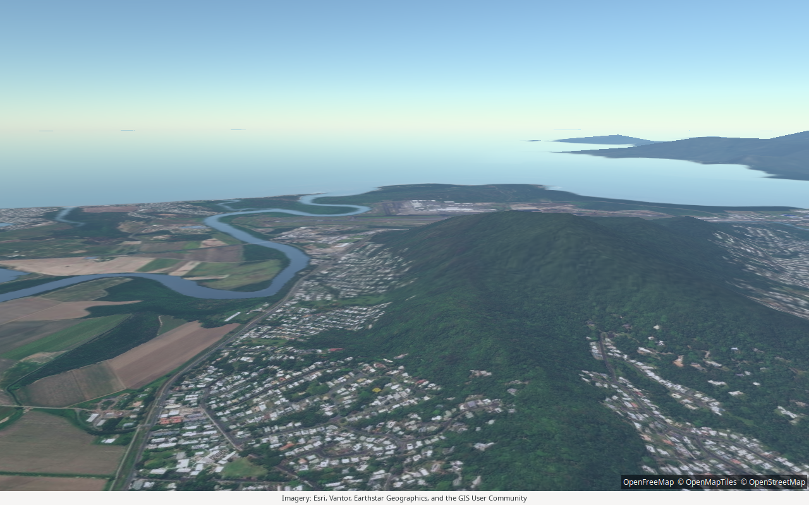
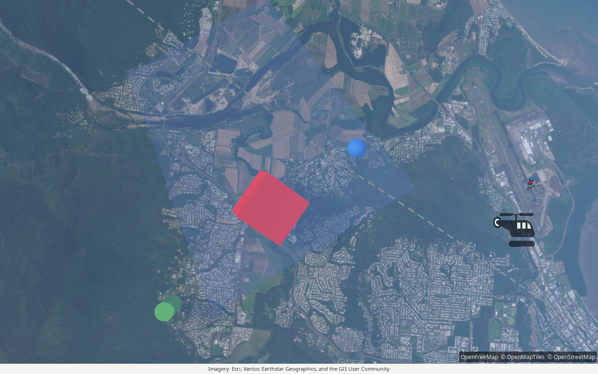
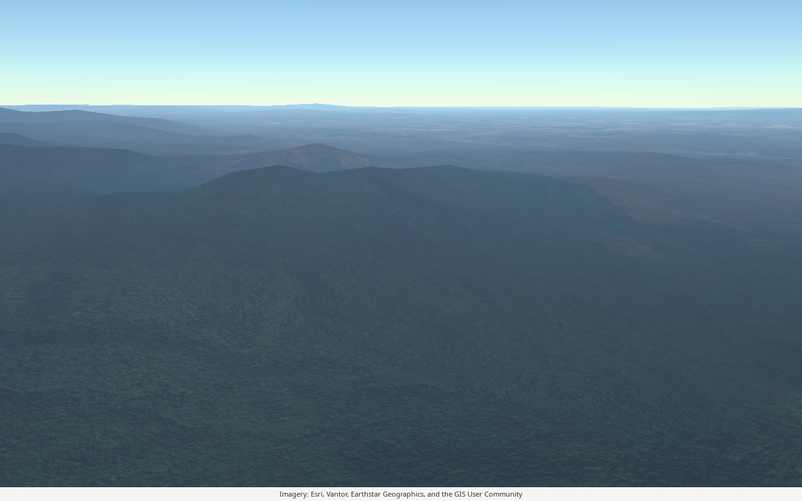
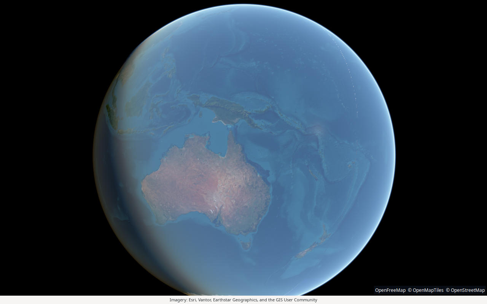

# GWorldScene

GWorldScene is a geospatial scene widget for GTK 3 and GTK 4, built on
`GtkGLArea`: terrain, map imagery, a globe view, and scene graph objects
positioned with latitude, longitude, altitude, and local NED orientation.

It is currently an experimental geospatial rendering library with a C API,
GObject Introspection metadata, generated Vala bindings, and SQGI examples.



## Screenshots

Captured from the GTK 4 build, with atmospheric scattering enabled. Water and
shadows are optional; these views show them enabled where appropriate.

| Scene objects and shadows | Mountain terrain and distance haze | Atmospheric globe and ocean reflections |
| --- | --- | --- |
|  |  |  |

Screenshot imagery: [Esri World Imagery](https://services.arcgisonline.com/ArcGIS/rest/services/World_Imagery/MapServer),
Vantor, Earthstar Geographics, and the GIS User Community. Water boundaries:
[OpenFreeMap](https://openfreemap.org/), [OpenMapTiles](https://openmaptiles.org/),
and [OpenStreetMap contributors](https://www.openstreetmap.org/copyright).

## Features

- GTK 3 and GTK 4 widget libraries built on `GtkGLArea`.
- Automatic desktop OpenGL 3.3 / OpenGL ES 3.0 context and shader selection.
- Shared core library for scene nodes, camera math, picking, and geodesy.
- Local terrain rendering from HGT-style elevation tiles.
- Slippy-map imagery with disk caching, trilinear mipmaps, and anisotropic filtering where available.
- Earth-scale globe rendering when zoomed far out.
- Default Google-Earth-style camera plus free camera mode.
- Scene graph nodes positioned by geodetic coordinates.
- Local NED orientation for nodes: yaw, pitch, and roll.
- Primitive nodes: cube, sphere, and cylinder.
- Assimp-backed model loading, including common formats such as GLB/glTF and OBJ.
- Billboards, ground overlays, polylines, polygons, circles, and text labels.
- AMSL, AGL, and clamp-to-ground altitude modes where supported.
- Atmospheric sky, horizon haze, and distance scattering from ground level to orbit.
- Elevation-derived terrain normals, linear-light rendering, and tone mapping.
- Roughness/metallic material lighting for primitives and imported models.
- Optional cascaded shadows with filtered edges and stable camera tracking.
- Optional reflective water with animated surface detail and automatic coastline/lake/river loading.
- Configurable sun position/time of day and additional distance fog.
- Picking signals for terrain and renderable scene nodes.
- C, Vala, and SQGI examples.

## Dependencies

GWorldScene is built with Meson and Ninja. It depends on:

- GTK 3, GTK 4, or both
- GObject Introspection
- gdk-pixbuf
- epoxy
- GDAL
- Assimp
- libsoup 3
- GLM
- zlib
- Vala, for the Vala example and generated VAPI

On Debian or Ubuntu-style systems:

```sh
sudo apt install meson ninja-build gcc g++ valac \
  libgtk-3-dev libgtk-4-dev libgirepository1.0-dev \
  libepoxy-dev libgdal-dev libassimp-dev libsoup-3.0-dev libglm-dev zlib1g-dev \
  libgdk-pixbuf-2.0-dev
```

## Build

```sh
meson setup builddir
ninja -C builddir
meson test -C builddir --print-errorlogs
```

Meson builds each backend whose development package is available. You can make
that explicit when packaging or testing a single backend:

```sh
meson setup builddir -Dgtk3=enabled -Dgtk4=disabled
meson setup builddir -Dgtk3=disabled -Dgtk4=enabled
```

When both backends are enabled, applications should still link only one of
`gworldscene-gtk3-0.1` or `gworldscene-gtk4-0.1` in a single process.

The widget tries desktop OpenGL 3.3 first, then OpenGL ES 3.0. Shaders are
selected from the actual current context; no GLES-specific build is needed.
GTK 4.12 and later applications can restrict selection with
`gtk_gl_area_set_allowed_apis()` before realization. On older GTK, setting
`use-es` to true requests GLES; the default permits automatic selection.
GTK 3's X11 backend may require `GDK_GL=gles` at process startup to select
GLES for its shared contexts.

The rendering tests exercise both APIs, atmospheric lighting, imported materials,
shadows, water masks and caching, scaled viewports, and context recreation. They
also check that staged imagery uploads finish while the camera is stationary.
They skip when no display is available. To run them with Mesa software rendering
on a headless Linux machine:

```sh
xvfb-run -a env LIBGL_ALWAYS_SOFTWARE=1 GSK_RENDERER=cairo GTK_A11Y=none \
  meson test -C builddir --suite render --print-errorlogs
```

The binding tests check scalar output direction, ownership, optionality, and
parameter order in both generated GIRs. When `sqgi` is available at configure
time, they also exercise multi-output getters and material, atmosphere, and water
controls against the build's typelibs and libraries, using a separate process
for each GTK version. These runtime tests skip without a display:

```sh
xvfb-run -a env GSK_RENDERER=cairo GTK_A11Y=none \
  meson test -C builddir --suite bindings --print-errorlogs
```

Install system-wide when you want the headers, pkg-config file, GIR, typelib,
and VAPI available to external programs:

```sh
sudo meson install -C builddir
```

The installed layout follows the platform GObject Introspection directories.
For example, on aarch64 Linux the typelibs are installed under
`/usr/lib/aarch64-linux-gnu/girepository-1.0/` as
`GWorldSceneGtk3-0.1.typelib` and `GWorldSceneGtk4-0.1.typelib`.

## Run The Demos

The main C demo starts near Cairns, Queensland, with terrain, satellite imagery,
atmospheric lighting, and a mix of scene nodes:

```sh
./builddir/examples/gworldscene-demo-gtk4
# or, when built with GTK 3:
./builddir/examples/gworldscene-demo-gtk3
```

The Vala control panel exposes map provider, terrain, atmosphere density/haze,
fog, sun, shadow, water/wave, and picking controls:

```sh
./builddir/examples/gworldscene-controls-gtk4
```

The SQGI scripts use the installed `GWorldSceneGtk3-0.1` or
`GWorldSceneGtk4-0.1` typelibs:

```sh
cd examples/sqgi
sqgi introspection-gtk3.nut
sqgi simple-scene-gtk3.nut
sqgi introspection-gtk4.nut
sqgi simple-scene-gtk4.nut
```

To run SQGI against an uninstalled build tree:

```sh
GI_TYPELIB_PATH=builddir/src \
LD_LIBRARY_PATH=builddir/src \
sqgi examples/sqgi/simple-scene-gtk4.nut
```

## Map Tiles And Terrain

The library default map tile template is OpenStreetMap:

```text
https://tile.openstreetmap.org/{z}/{x}/{y}.png
```

Applications can override map imagery with:

```c
gworld_scene_view_set_map_tile_url_template(view, "https://server/{z}/{x}/{y}.png");
```

The demo programs also honor:

```sh
export GWORLD_SCENE_MAP_TILE_URL_TEMPLATE='https://server/{z}/{x}/{y}.png'
```

For Google Map Tiles API experiments, the C demo can create a session when
`GWORLD_SCENE_GOOGLE_MAPS_API_KEY` is present. SQGI expects both the API key
and a session token:

```sh
export GWORLD_SCENE_GOOGLE_MAPS_API_KEY='...'
export GWORLD_SCENE_GOOGLE_MAPS_SESSION='...'
```

Terrain is loaded from HGT-style tile names such as `S16E145`. A terrain server
can be a base URL/directory or a template containing `{tile}` or `{name}`:

```c
gworld_scene_view_set_terrain_server(view, "https://example.com/terrain/data/");
gworld_scene_view_set_terrain_server(view, "https://example.com/{tile}.hgt.zip");
```

Disk caching is enabled by default and can be configured per view:

```c
gworld_scene_view_set_cache_directory(view, "/tmp/gworldscene-cache");
gworld_scene_view_set_cache_enabled(view, TRUE);
```

Terrain files are cached under `terrain/<SHA-256 of terrain-server>/<tile>.hgt`
or `<tile>.hgt.zip`. Each source has its own directory, including distinct URL
templates and query parameters. Switching sources cannot reuse another source's
elevations. Older files directly under `terrain/` are left on disk and ignored;
the library downloads fresh copies into the source-specific directories.

The local scene renders while elevation tiles are loading. Missing tiles use a
sea-level surface for imagery, then update as terrain arrives. Slow or unavailable
terrain requests do not prevent scene objects or imagery from appearing.

Terrain imagery uses five overlapping distance bands. Near the ground around
Cairns, the default tile budget gives approximately:

| Band | Coverage radius | Imagery zoom |
| --- | ---: | ---: |
| Ultra | Up to 1 km | 18 |
| Detail | 2 km | 16 |
| Mid | 8 km | 14 |
| Far | 33 km | 12 |
| Base | Full terrain extent | 10 or lower |

Each two-level zoom step increases ground pixel size by 4×. Adjacent bands blend
at their edges and keep coarser imagery visible while finer tiles load. Altitude
above ground adjusts the zoom levels; latitude, texture-memory presets, and GPU
texture limits determine each band's coverage. Larger presets extend coverage
at the same resolution. With the default 64-tile limit, the extra far band uses
about 21.3 MiB of resident texture memory including its mip chain, plus temporary
upload storage. Mipmaps and up to 8× anisotropic filtering preserve detail at
oblique viewing angles; linear-light filtering avoids dark seams around missing
tiles.

## Graphics And Optional Effects

The default appearance includes atmospheric scattering, terrain lighting,
roughness/metallic materials, filtered imagery, and linear-light tone mapping.
Shadows, reflective water, and extra distance fog are disabled by default.

| Control | Default | Effect |
| --- | --- | --- |
| `atmosphere-enabled` | `true` | Sky, curved horizon, and aerial perspective |
| `atmosphere-density` / `atmosphere-haze` | `1` / `1` | Air density and aerosol haze, each adjustable from 0 to 4 |
| `shadows-enabled` | `false` | Three filtered shadow cascades for terrain and scene objects |
| `water-enabled` | `false` | Automatic water boundaries, sky reflections, and sun highlights |
| `water-wave-strength` | `0.35` | Animated surface detail; set to 0 for still water |
| `fog-enabled` | `false` | Additional configurable distance fog |

For example, in C:

```c
gworld_scene_view_set_atmosphere_haze(view, 0.7);
gworld_scene_view_set_shadows_enabled(view, TRUE);
gworld_scene_view_set_water_enabled(view, TRUE);
gworld_scene_view_set_water_wave_strength(view, 0.35);
```

The equivalent SQGI/Vala methods are `view.set_atmosphere_haze(0.7)`,
`view.set_shadows_enabled(true)`, and `view.set_water_enabled(true)`.
The controls demo provides interactive toggles for these effects.

Water boundaries load asynchronously from OSM-derived OpenFreeMap vector tiles;
no API key is required. Oceans, lakes, and river polygons retain islands, and
missing data leaves the imagery visible. Flat terrain is never treated as proof
of water. The widget displays clickable data-source credits when water is enabled.

Water tiles use a separate `water/<provider-hash>/<z>/<x>/<y>.pbf` cache under the
view's cache directory. A custom OpenMapTiles-compatible provider can be selected
with `set_water_tile_url_template()`; passing `NULL` restores the default.
The provider's URL is hashed for cache isolation, including any query parameters.

Water currently reflects the sky and sun and follows the elevation mesh; it does
not flatten lake levels or reflect scene objects. Optional effects add rendering
and memory cost. See [graphics settings and tradeoffs](docs/concepts.rst) for
resource use, cache behavior, and material-import limitations.

## Coordinates

Positions use geodetic coordinates:

- `latitude`: degrees north.
- `longitude`: degrees east.
- `altitude_amsl`: metres above mean sea level.

East/west movement wraps longitude across the dateline. Terrain and imagery
ranges span both sides, so crossing ±180 degrees does not stop movement or drop
the adjacent tiles.

Scene node orientation uses the local NED frame:

- `yaw`: heading in degrees clockwise from geographic north.
- `pitch`: rotation around the local east/right axis.
- `roll`: rotation around the local north/forward axis.

Imported models are interpreted with NED-friendly axes: `+Z` is north/forward,
`+X` is east/right, and `+Y` is up. Model units are treated as metres before
node scale is applied.

## Scene Nodes

All renderable objects inherit from `GWorldSceneNode`. The view owns the nodes
returned from `add_*` methods; keep the returned pointer while you want to
modify the object, but do not unref it yourself.

Common node operations include:

- `set_position()`
- `translate_ned()`
- `slew_position()`
- `set_orientation_ned()`
- `rotate_ned()`
- `set_scale()`
- `set_color()`
- `set_roughness()`
- `set_metallic()`

Roughness and metallic overrides accept values from 0 to 1. Set either to `-1`
(the default) to use the imported material or primitive defaults. Imported scalar
material factors are supported; normal and packed material textures are not yet
sampled.

Current renderable node types:

- `GWorldSceneCubeNode`
- `GWorldSceneSphereNode`
- `GWorldSceneCylinderNode`
- `GWorldSceneModelNode`
- `GWorldSceneBillboardNode`
- `GWorldSceneGroundOverlayNode`
- `GWorldScenePolylineNode`
- `GWorldScenePolygonNode`
- `GWorldSceneCircleNode`
- `GWorldSceneTextLabelNode`

## Minimal C Example

```c
#include <gtk/gtk.h>
#include <gworldscene/gworldscene.h>

static void
activate(GtkApplication *app)
{
  GtkWidget *window = gtk_application_window_new(app);
  GtkWidget *view = gworld_scene_view_new();

  gworld_scene_view_set_camera(GWORLD_SCENE_VIEW(view),
                               -16.8878,
                               145.7048,
                               7800.0);
  gworld_scene_view_set_camera_orientation(GWORLD_SCENE_VIEW(view), 72.0, -66.0);

  GWorldSceneCubeNode *cube =
    gworld_scene_view_add_cube(GWORLD_SCENE_VIEW(view),
                               -16.8878,
                               145.7048,
                               650.0,
                               900.0,
                               900.0,
                               900.0);
  gworld_scene_node_set_color(GWORLD_SCENE_NODE(cube), 1.0, 0.08, 0.02);

  gtk_window_set_child(GTK_WINDOW(window), view);
  gtk_window_present(GTK_WINDOW(window));
}
```

Compile an installed library with pkg-config:

```sh
cc app.c -o app $(pkg-config --cflags --libs gworldscene-gtk4-0.1)
```

## Language Bindings

C uses the umbrella header:

```c
#include <gworldscene/gworldscene.h>
```

Vala uses the generated package:

```sh
valac --pkg gtk4 --pkg GWorldSceneGtk4-0.1 app.vala
```

SQGI imports the typelib:

```nut
local Gtk = import("Gtk", "4.0")
local GWorldScene = import("GWorldSceneGtk4", "0.1")
```

## Documentation

The Sphinx docs live in `docs/` and include installation notes, concepts, C
examples, Vala examples, SQGI examples, and an API reference.

Build them locally with:

```sh
python3 -m venv /tmp/gworldscene-docs-venv
/tmp/gworldscene-docs-venv/bin/pip install -r docs/requirements.txt
/tmp/gworldscene-docs-venv/bin/sphinx-build -b html -W docs /tmp/gworldscene-docs-html
```

## Project Status

This is early-stage rendering work. The API is useful enough for demos and
experiments, but it should still be treated as evolving. Expect behavior around
tile providers, globe LOD, terrain sampling, and model import details to keep
improving.
